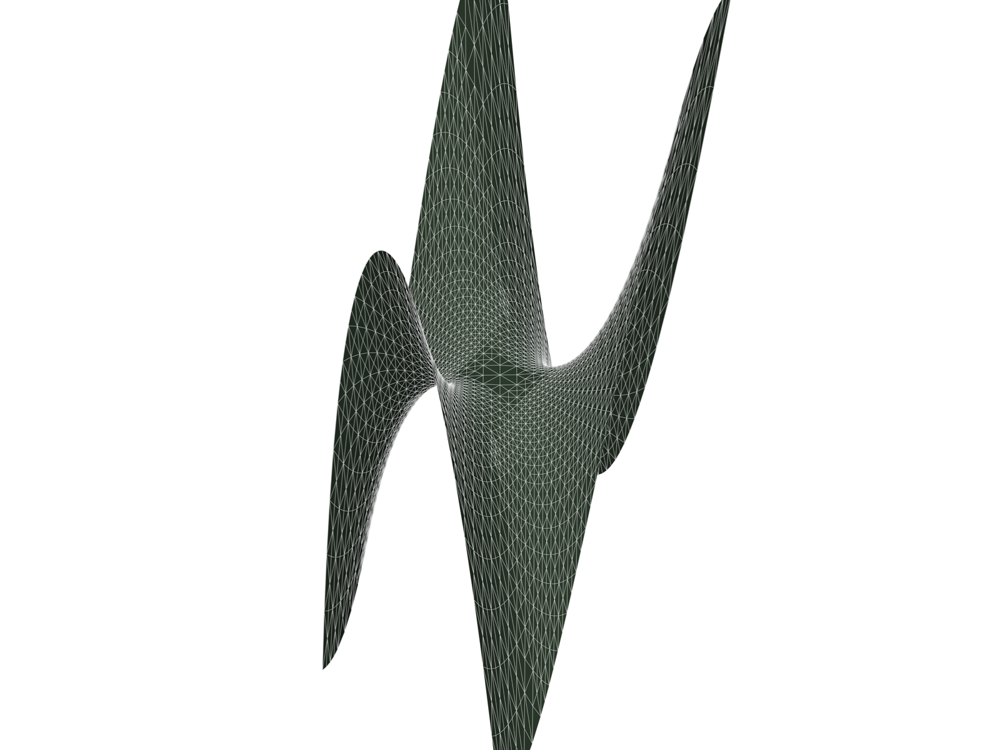
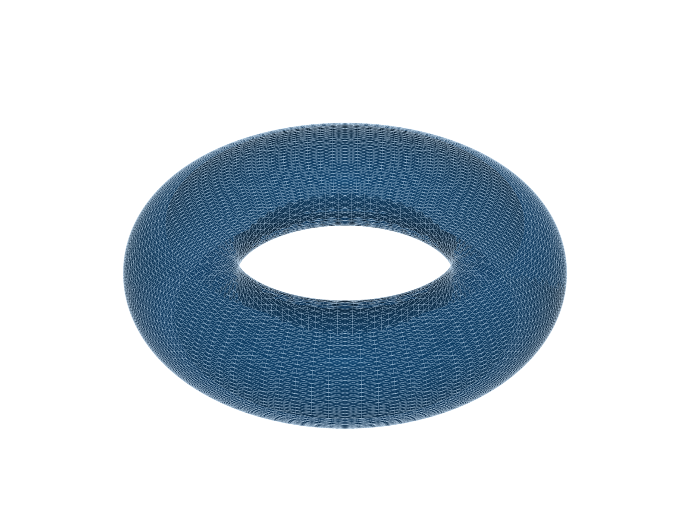
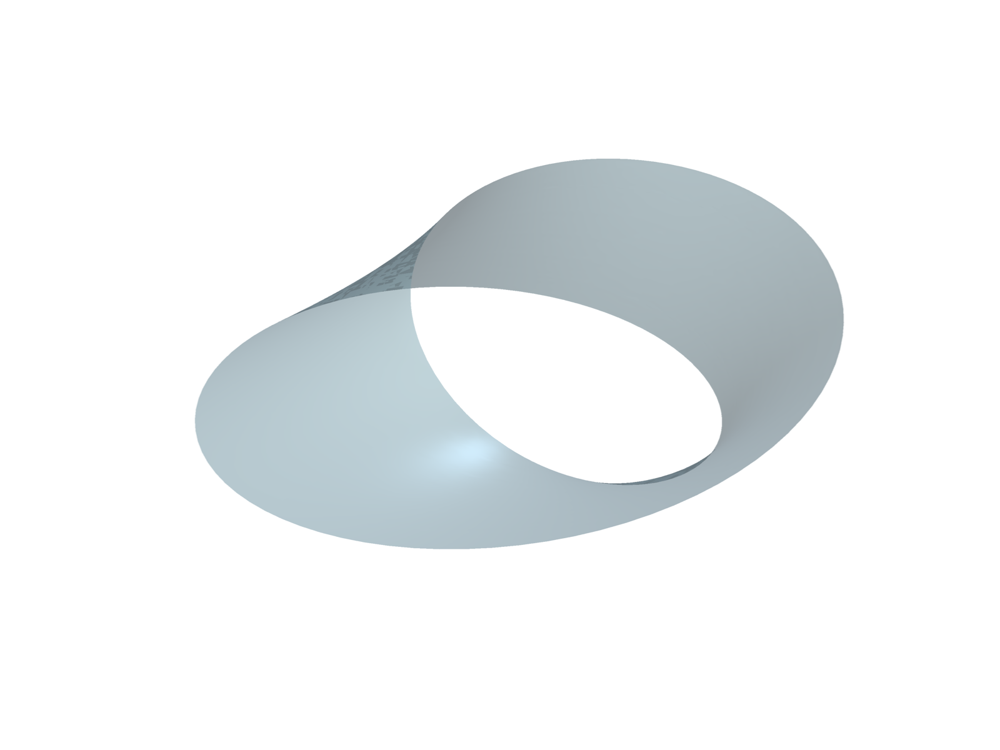
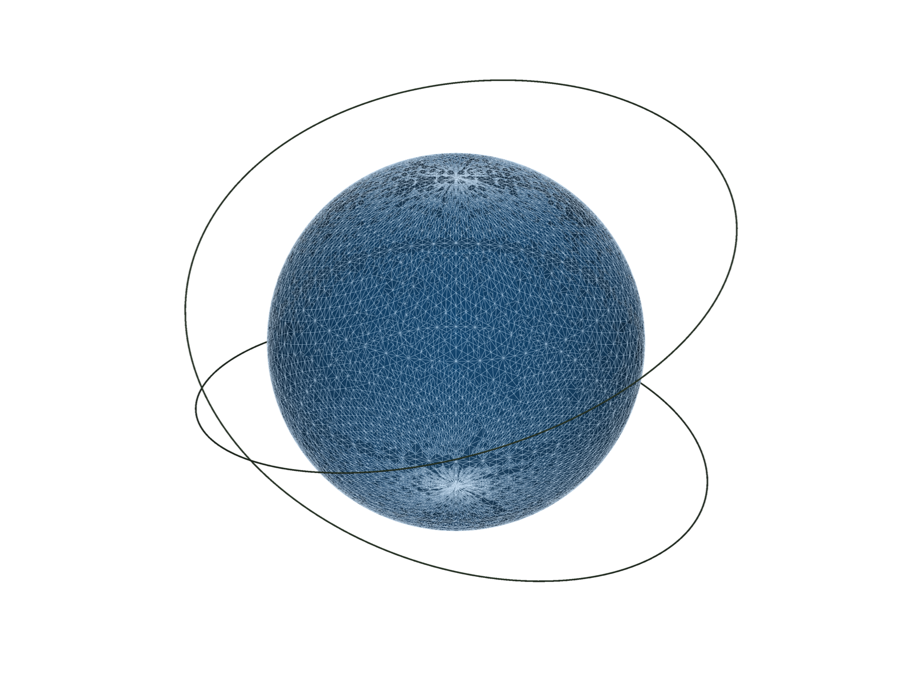

<h1 align="center">sheaf</h1>

<p align="center">
  <em>Declarative 3D graphics DSL producing publication-grade vector figures for LaTeX papers.</em>
</p>

<p align="center">
  <a href="https://www.python.org"></a>
  <a href="LICENSE"></a>
  <a href="#status"></a>
  <a href="tests/"></a>
  <a href="https://github.com/astral-sh/ruff"></a>
</p>

<p align="center">
  
</p>

`sheaf` lowers a single symbolic expression into a typeset-ready 3D figure.
A curvature-driven adaptive mesher resolves every singularity automatically,
an academic material system gives the scene voice, and (by Month 2) a BSP
painter's-algorithm pipeline compiles the figure directly to TikZ / PGFPlots
— no raster step, no DPI loss, no font mismatch with the surrounding math.

```python
from sheaf import Surface, Chalkboard, Paper
from sympy.abc import x, y

Surface(z=x**3 - 3*x*y**2) @ Chalkboard >> Paper("main.tex", label="fig:monkey")
```

## Gallery

Every figure is declared by a single DSL expression and rendered through the
PyVista preview driver. The adaptive mesher concentrates triangles where
curvature or parametric degeneracy is highest — visible as the denser
wireframe along the saddle ridges, the inner torus tube, and the sphere's
poles.

<table>
  <tr>
    <td width="50%" align="center">
      <br>
      <sub><code>Surface(z=x**3 - 3*x*y**2) @ Chalkboard</code></sub>
    </td>
    <td width="50%" align="center">
      <br>
      <sub>parametric torus <code>@ Blueprint</code></sub>
    </td>
  </tr>
  <tr>
    <td width="50%" align="center">
      <br>
      <sub>Möbius strip <code>@ Glass</code> &mdash; non-orientability through translucency</sub>
    </td>
    <td width="50%" align="center">
      <br>
      <sub><code>sphere @ Blueprint + helix @ Chalkboard</code></sub>
    </td>
  </tr>
</table>

Regenerate with:

```bash
python examples/gallery.py
```

## Why `sheaf`

Existing scientific 3D tools fall into two camps, both with a fundamental
compromise when the target is a published paper:

1. **Raster pipelines** (matplotlib, Mayavi, MATLAB) produce anti-aliased
   bitmaps that clash with vector math fonts at 600&nbsp;dpi zoom-in.
2. **Hand-written TikZ / PGFPlots** is vector-perfect but requires manual
   sampling, manual hidden-surface ordering, and has no awareness of
   singularities.

`sheaf` closes the gap by keeping the **entire pipeline symbolic-aware**:
SymPy expressions flow through a curvature-driven adaptive mesher, then a
BSP painter's-algorithm compiler (Month 2) emits native `\draw` / `\fill`
paths sized to the host `\documentclass`. The figure becomes part of the
document, not pasted onto it.

## Install

### From source

```bash
git clone https://github.com/mirakurutomato/sheaf.git
cd sheaf
pip install -e ".[preview,dev]"
```

Python 3.12 or newer is required. The `preview` extra installs PyVista /
VisPy for interactive rendering; `dev` adds `pytest`, `ruff`, and `mypy`.

### From PyPI

Planned for the Month 3 release (2026-07-21).

## Quick start

```python
from sheaf import Surface, Chalkboard
from sheaf.preview import preview, screenshot
from sympy.abc import x, y

saddle = Surface(z=x**3 - 3*x*y**2, x=(-1.2, 1.2), y=(-1.2, 1.2))

preview(saddle @ Chalkboard)                   # interactive VTK window
screenshot(saddle @ Chalkboard, "saddle.png")  # headless high-DPI PNG
```

For the W8 vector pipeline, lower the same surface to back-to-front-sorted
TikZ that any LaTeX engine can compile:

```python
from sheaf import Surface, Chalkboard
from sheaf.numeric import adaptive_mesh, compiled
from sheaf.vector import Camera, emit_tikz, tikz_document
from sympy.abc import x, y

mesh = adaptive_mesh(compiled(Surface(z=x**2 + y**2, x=(-1, 1), y=(-1, 1))))
src  = tikz_document(emit_tikz(mesh, Camera.isometric(), Chalkboard))
# `pdflatex` consumes `src` directly — no preamble setup required.
```

`examples/tikz_emit.py` runs this end-to-end and writes
`examples/gallery/tikz_emit.{tex,pdf}`.

## Operator semantics

| Operator | Meaning                                   | Example                       |
|:--------:|:------------------------------------------|:------------------------------|
| `+`      | Scene composition                         | `Axes() + Surface(z=x*y)`     |
| `@`      | Material application (binds tight)        | `Surface(z=x*y) @ Chalkboard` |
| `>>`     | Render to `Paper` (LaTeX / PDF artefact)  | `scene >> Paper("main.tex")`  |
| `&`      | CSG intersection (`Implicit`)             | `torus & sphere`              |
| `\|`     | CSG union (`Implicit`)                    | `torus \| sphere`             |
| `-`      | CSG difference (`Implicit`)               | `torus - sphere`              |
| `^`      | CSG symmetric difference (`Implicit`)     | `torus ^ sphere`              |

`@` is Python's `matmul`: its precedence is tight enough that
`Axes() + Surface(z=f) @ Chalkboard + Curve(...) >> Paper(...)` evaluates as
it reads — no parentheses.

## Architecture

```text
         DSL Layer  (SymPy expressions, operator overloading)
              │
              ▼  symbolic → numeric compile
       Adaptive Mesh Engine         ← Rivara LEB + σ_min(J) + chord ε
              │
       ┌──────┴──────┐
       ▼             ▼
   PyVista      Vector Pipeline      ← BSP + painter sort → TikZ codegen
   preview      (Month 2 W7–W8 ✓)
                    │
                    ▼
              LaTeX Sync              ← main.tex parser, \linewidth, font
                                        (Month 3 W9)
```

## Status

**Pre-alpha.** Month 1 complete + Month 2 fully delivered (2026-04-21 → 2026-06-16):

- **W1** — DSL scaffold (`Surface`, `Curve`, `Implicit`, `Scene`, `Paper`),
  material presets, preview-driver ABC, LaTeX compile harness (`pdflatex`
  and `lualatex` both in CI scope).
- **W2** — Symbolic → numeric compiler (`sheaf.numeric.compiled`) retaining
  the symbolic Jacobian; singular-point detection via grid SVD and
  `scipy.ndimage` connected components. Handles explicit, parametric,
  curve (cusp), and implicit (apex) singularities.
- **W3** — Curvature-driven adaptive mesher (`sheaf.numeric.adaptive_mesh`).
  Rivara longest-edge bisection with a priority queue keyed on
  `max(chord_error, 1 / σ_min(J))`. Conforming (no T-junctions) and budget
  aware.
- **W4** — PyVista preview fully wired into the adaptive mesh; material
  translation unit tests and headless screenshot regression guarding the
  hue family of each preset (`test_preview_visual.py`).
- **W5** — Mesh topology analysis (`sheaf.numeric.topology`).
  `analyze(mesh)` returns boundary edges, non-manifold edges, connected
  components, Euler characteristic, closedness / manifoldness / orientability;
  `weld_duplicate_vertices` collapses geometric duplicates so parametric
  closed surfaces (sphere, torus) recover their true topology and even the
  Möbius twist (a *geometric* identification in the chosen parametrisation)
  is correctly detected as non-orientable.

- **W6** — Hessian-eigenvalue critical-point classification
  (`sheaf.numeric.curvature`). For every explicit surface `z = f(u, v)`,
  `classify_critical_points` locates stationary points by cell-wise
  sign-change detection on ∇f and labels each with its Hessian signature:
  `"minimum"`, `"maximum"`, `"saddle"`, or `"degenerate"` (monkey saddle).
  The companion `sheaf.preview.accent_lights` turns the classification into
  declarative `AccentLight` descriptors — warm key above minima, cool rim
  beneath maxima, neutral grazing rim across saddles — scaled by the scene
  bounding box and ready for the PyVista driver / TikZ shader.

- **W7** — BSP painter's-algorithm hidden-surface removal
  (`sheaf.vector.bsp`). A Binary Space Partition tree classifies triangles
  (FRONT / BACK / COPLANAR / SPANNING) against each splitter plane;
  SPANNING triangles are Sutherland-Hodgman-clipped into front- and
  back-half fragments.  `paint(tree, view)` returns a strict back-to-front
  order for the vector emitter in W8.  On a convex body every back-facing
  triangle is emitted before every front-facing one — the certificate that
  no painter-order violation remains.  The build is iterative (explicit
  work stack, no Python recursion limit on deep trees) and the splitter is
  chosen by an 8-candidate, fully-vectorised SPANNING-minimisation
  heuristic so that mesh-conforming inputs incur zero splits.

- **W8** — TikZ code generator (`sheaf.vector.tikz`) and orthographic
  axonometric `Camera` (`sheaf.vector.camera`).  `emit_tikz(mesh, camera,
  material)` returns a `\begin{tikzpicture}` body whose `\fill` paths are
  ordered by the W7 painter, with per-figure `\definecolor` for the
  material's surface fill and (optional) wire colour, plus `fill opacity`
  for translucent materials such as `Glass`.  `tikz_document(body)` wraps
  the body in a minimal `standalone` document for one-shot compilation.
  **Month 2 gate met**: a real surface goes through adaptive mesh → BSP
  sort → TikZ → `pdflatex` end-to-end with returncode 0 across every
  shipped material preset.

Validation gates met: sphere polar density ≥ 2× equatorial; Gaussian-peak
origin density ≥ 2× ring; every mesh edge shared by ≤ 2 triangles; sphere
χ = 2, torus χ = 0, Möbius non-orientable after welding; paraboloid →
minimum, inverted paraboloid → maximum, `x² − y²` → saddle, monkey saddle
→ degenerate, tilted plane → no critical points; tetrahedron back-faces
paint before front-faces; Sutherland-Hodgman split conserves triangle
area; pdflatex compiles emitted TikZ for Chalkboard, Blueprint, and Glass.
**103 tests pass**, `ruff` clean.

Next up (Month 3): PGFPlots backend + `main.tex` parser (W9).

## Running the tests

```bash
pytest
```

LaTeX-integration tests execute automatically when `pdflatex` or `lualatex`
is on `PATH`; otherwise they skip cleanly.

## Contributing

The project is exploratory and internal interfaces are expected to change
weekly through the Month 2–3 timeline. Issues and design discussion are
welcome. Before opening a pull request please run:

```bash
ruff check .
pytest
```

## License

[Apache License 2.0](LICENSE). The patent grant is intentional: `sheaf`
targets academic and industrial adoption alike.

## Acknowledgements

`sheaf` stands on the shoulders of [SymPy](https://www.sympy.org),
[NumPy](https://numpy.org), [SciPy](https://scipy.org),
[PyVista](https://pyvista.org), [trimesh](https://trimesh.org), and
[manifold3d](https://github.com/elalish/manifold). Special credit to the
TikZ / PGFPlots authors for keeping vector mathematics beautiful.
