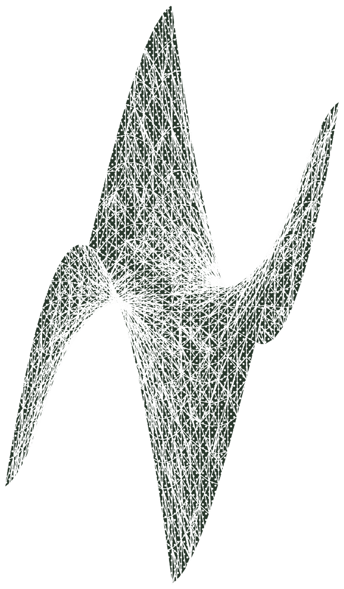
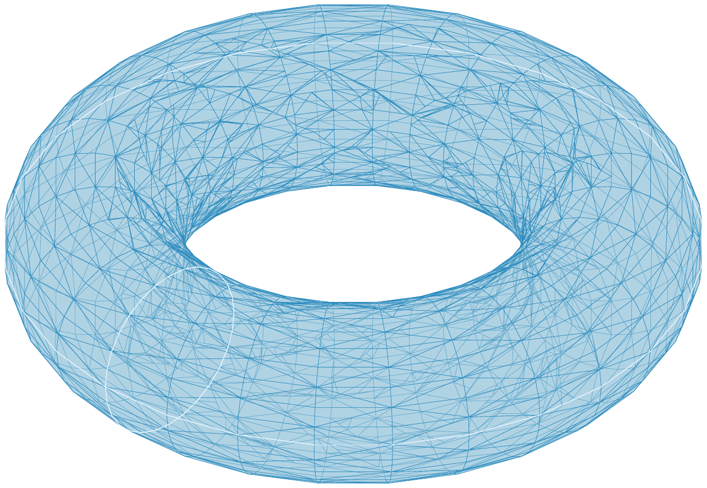
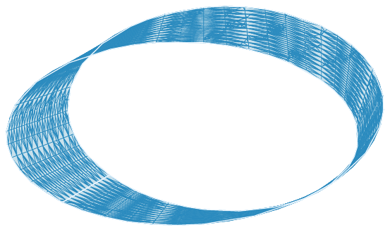
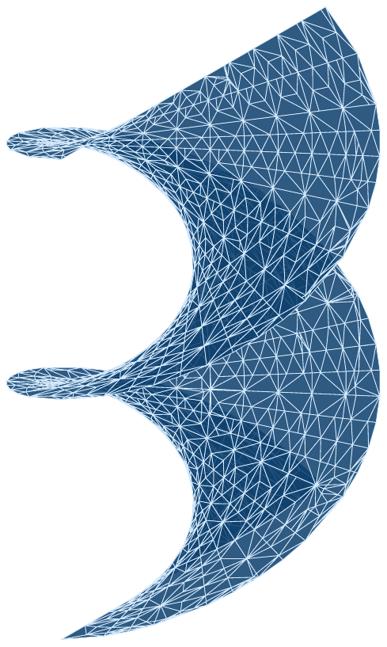

<h1 align="center">sheaf</h1>

<p align="center">
  <em>Declarative 3D graphics DSL producing publication-grade vector figures for LaTeX papers.</em>
</p>

<p align="center">
  <a href="https://www.python.org"></a>
  <a href="LICENSE"></a>
  <a href="#status"></a>
  <a href="https://github.com/mirakurutomato/sheaf/actions/workflows/ci.yml"></a>
  <a href="tests/"></a>
  <a href="https://github.com/astral-sh/ruff"></a>
  <a href="https://doi.org/10.5281/zenodo.19685861"></a>
</p>

<p align="center">
  
</p>

<p align="center">
  <em>TikZ → PDF → PNG of <code>Surface(z=x**3 - 3*x*y**2) @ Chalkboard</code>. The chalk-dust pattern is a real TikZ <code>patterns</code> overlay, not a bitmap.</em>
</p>

`sheaf` lowers a single symbolic expression into a typeset-ready 3D figure.
A curvature-driven adaptive mesher resolves every singularity automatically,
an academic material system gives the scene voice, and (by Month 2) a BSP
painter's-algorithm pipeline compiles the figure directly to TikZ / PGFPlots
— no raster step, no DPI loss, no font mismatch with the surrounding math.

```python
from sheaf import Surface, Chalkboard, Paper
from sympy.abc import x, y

Surface(z=x**3 - 3*x*y**2) @ Chalkboard >> Paper("main.tex", label="fig:monkey")
```

## Gallery

Every figure below is declared by a single DSL expression, lowered through
the W3 adaptive mesher, painter-sorted by the W7 BSP tree, and emitted as
a standalone TikZ document by W8–W10.  The images are 300 dpi
rasterisations of the actual PDFs — the chalk-dust hatch, the glass
translucency, and the open-boundary glow all ship directly to your
paper as vector primitives.

<table>
  <tr>
    <td width="50%" align="center">
      <br>
      <sub><code>Surface(z=x**3 - 3*x*y**2) @ Chalkboard</code><br>
      Chalkboard overlays a TikZ <code>patterns</code> crosshatch (W10).</sub>
    </td>
    <td width="50%" align="center">
      <br>
      <sub>parametric torus <code>@ Glass</code><br>
      Closed surface: topology analysis (W5) skips the boundary glow.</sub>
    </td>
  </tr>
  <tr>
    <td width="50%" align="center">
      <br>
      <sub>Möbius strip <code>@ Glass</code><br>
      Open surface: the two boundary circles glow (W10 Glass).</sub>
    </td>
    <td width="50%" align="center">
      <br>
      <sub>helicoid <code>@ Blueprint</code><br>
      Ruled minimal surface; Blueprint keeps the ink-on-paper feel.</sub>
    </td>
  </tr>
</table>

Rebuild the hero images (requires ``pdflatex`` and ``pdftoppm``, both in
TeX Live):

```bash
python examples/build_hero.py
```

The **full 12-item publication-grade catalog** lives at
[`examples/gallery_catalog.py`](examples/gallery_catalog.py), is
documented at [`docs/gallery.md`](docs/gallery.md), and is driven by

```bash
python examples/build_gallery.py
```

which emits `examples/gallery/tex/<name>.{tex,pdf}` for every entry.
`examples/gallery.py` produces the developer-facing PyVista previews
(`examples/gallery/*.png`); those are raster and live separately from
the vector pipeline shown above.

## Why `sheaf`

Existing scientific 3D tools fall into two camps, both with a fundamental
compromise when the target is a published paper:

1. **Raster pipelines** (matplotlib, Mayavi, MATLAB) produce anti-aliased
   bitmaps that clash with vector math fonts at 600&nbsp;dpi zoom-in.
2. **Hand-written TikZ / PGFPlots** is vector-perfect but requires manual
   sampling, manual hidden-surface ordering, and has no awareness of
   singularities.

`sheaf` closes the gap by keeping the **entire pipeline symbolic-aware**:
SymPy expressions flow through a curvature-driven adaptive mesher, then a
BSP painter's-algorithm compiler (Month 2) emits native `\draw` / `\fill`
paths sized to the host `\documentclass`. The figure becomes part of the
document, not pasted onto it.

## Install

### From source

```bash
git clone https://github.com/mirakurutomato/sheaf.git
cd sheaf
pip install -e ".[preview,dev]"
```

Python 3.12 or newer is required. The `preview` extra installs PyVista /
VisPy for interactive rendering; `dev` adds `pytest`, `ruff`, and `mypy`.

### From PyPI

Planned for the first tagged release; the source tree already corresponds
to the post-W12 roadmap state.

## Quick start

```python
from sheaf import Surface, Chalkboard
from sheaf.preview import preview, screenshot
from sympy.abc import x, y

saddle = Surface(z=x**3 - 3*x*y**2, x=(-1.2, 1.2), y=(-1.2, 1.2))

preview(saddle @ Chalkboard)                   # interactive VTK window
screenshot(saddle @ Chalkboard, "saddle.png")  # headless high-DPI PNG
```

For the W8 vector pipeline, lower the same surface to back-to-front-sorted
TikZ that any LaTeX engine can compile:

```python
from sheaf import Surface, Chalkboard
from sheaf.numeric import adaptive_mesh, compiled
from sheaf.vector import Camera, emit_tikz, tikz_document
from sympy.abc import x, y

mesh = adaptive_mesh(compiled(Surface(z=x**2 + y**2, x=(-1, 1), y=(-1, 1))))
src  = tikz_document(emit_tikz(mesh, Camera.isometric(), Chalkboard))
# `pdflatex` consumes `src` directly — no preamble setup required.
```

`examples/tikz_emit.py` runs this end-to-end and writes
`examples/gallery/tikz_emit.{tex,pdf}`.

## Operator semantics

| Operator | Meaning                                   | Example                       |
|:--------:|:------------------------------------------|:------------------------------|
| `+`      | Scene composition                         | `Axes() + Surface(z=x*y)`     |
| `@`      | Material application (binds tight)        | `Surface(z=x*y) @ Chalkboard` |
| `>>`     | Render to `Paper` (LaTeX / PDF artefact)  | `scene >> Paper("main.tex")`  |
| `&`      | CSG intersection (`Implicit`)             | `torus & sphere`              |
| `\|`     | CSG union (`Implicit`)                    | `torus \| sphere`             |
| `-`      | CSG difference (`Implicit`)               | `torus - sphere`              |
| `^`      | CSG symmetric difference (`Implicit`)     | `torus ^ sphere`              |

`@` is Python's `matmul`: its precedence is tight enough that
`Axes() + Surface(z=f) @ Chalkboard + Curve(...) >> Paper(...)` evaluates as
it reads — no parentheses.

## Architecture

```text
         DSL Layer  (SymPy expressions, operator overloading)
              │
              ▼  symbolic → numeric compile
       Adaptive Mesh Engine         ← Rivara LEB + σ_min(J) + chord ε
              │
       ┌──────┴──────┐
       ▼             ▼
   PyVista      Vector Pipeline      ← BSP + painter sort → TikZ
   preview      (Month 2 W7–W8 ✓)      + PGFPlots (W9 ✓)
                    │                   + material refinement (W10 ✓)
                    ▼                   + CI compile matrix (W11 ✓)
              LaTeX Sync              ← main.tex parser, \documentclass,
              (Month 3 W9 ✓)            geometry, fontspec → engine hint
                    │
                    ▼
              Gallery + docs          ← 12 curated figures, per-phase
              (Month 3 W12 ✓)           bench, bbox gate (< 1 pt)
```

## Status

**Pre-alpha.** The full 12-week roadmap (W1 → W12, originally planned
for 2026-04-21 → 2026-07-21) was implemented across the two-day window
**2026-04-21 → 2026-04-22**. The weekly bullets below preserve the
roadmap's milestone structure for orientation; every gate listed was
landed during that window:

- **W1** — DSL scaffold (`Surface`, `Curve`, `Implicit`, `Scene`, `Paper`),
  material presets, preview-driver ABC, LaTeX compile harness (`pdflatex`
  and `lualatex` both in CI scope).
- **W2** — Symbolic → numeric compiler (`sheaf.numeric.compiled`) retaining
  the symbolic Jacobian; singular-point detection via grid SVD and
  `scipy.ndimage` connected components. Handles explicit, parametric,
  curve (cusp), and implicit (apex) singularities.
- **W3** — Curvature-driven adaptive mesher (`sheaf.numeric.adaptive_mesh`).
  Rivara longest-edge bisection with a priority queue keyed on
  `max(chord_error, 1 / σ_min(J))`. Conforming (no T-junctions) and budget
  aware.
- **W4** — PyVista preview fully wired into the adaptive mesh; material
  translation unit tests and headless screenshot regression guarding the
  hue family of each preset (`test_preview_visual.py`).
- **W5** — Mesh topology analysis (`sheaf.numeric.topology`).
  `analyze(mesh)` returns boundary edges, non-manifold edges, connected
  components, Euler characteristic, closedness / manifoldness / orientability;
  `weld_duplicate_vertices` collapses geometric duplicates so parametric
  closed surfaces (sphere, torus) recover their true topology and even the
  Möbius twist (a *geometric* identification in the chosen parametrisation)
  is correctly detected as non-orientable.

- **W6** — Hessian-eigenvalue critical-point classification
  (`sheaf.numeric.curvature`). For every explicit surface `z = f(u, v)`,
  `classify_critical_points` locates stationary points by cell-wise
  sign-change detection on ∇f and labels each with its Hessian signature:
  `"minimum"`, `"maximum"`, `"saddle"`, or `"degenerate"` (monkey saddle).
  The companion `sheaf.preview.accent_lights` turns the classification into
  declarative `AccentLight` descriptors — warm key above minima, cool rim
  beneath maxima, neutral grazing rim across saddles — scaled by the scene
  bounding box and ready for the PyVista driver / TikZ shader.

- **W7** — BSP painter's-algorithm hidden-surface removal
  (`sheaf.vector.bsp`). A Binary Space Partition tree classifies triangles
  (FRONT / BACK / COPLANAR / SPANNING) against each splitter plane;
  SPANNING triangles are Sutherland-Hodgman-clipped into front- and
  back-half fragments.  `paint(tree, view)` returns a strict back-to-front
  order for the vector emitter in W8.  On a convex body every back-facing
  triangle is emitted before every front-facing one — the certificate that
  no painter-order violation remains.  The build is iterative (explicit
  work stack, no Python recursion limit on deep trees) and the splitter is
  chosen by an 8-candidate, fully-vectorised SPANNING-minimisation
  heuristic so that mesh-conforming inputs incur zero splits.

- **W8** — TikZ code generator (`sheaf.vector.tikz`) and orthographic
  axonometric `Camera` (`sheaf.vector.camera`).  `emit_tikz(mesh, camera,
  material)` returns a `\begin{tikzpicture}` body whose `\fill` paths are
  ordered by the W7 painter, with per-figure `\definecolor` for the
  material's surface fill and (optional) wire colour, plus `fill opacity`
  for translucent materials such as `Glass`.  `tikz_document(body)` wraps
  the body in a minimal `standalone` document for one-shot compilation.
  **Month 2 gate met**: a real surface goes through adaptive mesh → BSP
  sort → TikZ → `pdflatex` end-to-end with returncode 0 across every
  shipped material preset.

- **W9** — PGFPlots backend (`sheaf.vector.pgfplots`) and `main.tex`
  preamble parser (`sheaf.io.parse_main_tex`).  `emit_pgfplots` lowers an
  `AdaptiveMesh` into a single `\addplot3 [patch, patch type=triangle]`
  directive viewed under the camera's converted `view={az}{el}`;
  `pgfplots_document(body)` wraps it in a `standalone` document with
  `\usepackage{pgfplots}` + `\pgfplotsset{compat=1.18}`.  The preamble
  parser returns a `PaperContext` with `documentclass`, options, the
  resolved `textwidth_pt` (via the `geometry` package when present, else
  the standard-class default table), and a `recommended_engine` of
  `lualatex` whenever `fontspec` or `unicode-math` is loaded.  `Paper`
  is now wired end-to-end: `Surface(...) @ Material >> Paper(main_tex,
  engine=...)` returns a `PaperArtifact` carrying the picture body, the
  full standalone source, and the parsed `PaperContext`.

- **W10** — Material preset refinement for the vector pipeline.  A new
  `sheaf.materials.VectorParams` dataclass + `resolve_vector_params()`
  funnels every per-figure default (surface fill, wire colour, alpha,
  wire width, boundary glow, hatch pattern) through a single resolver so
  the TikZ and PGFPlots emitters can no longer drift as the schema
  grows.  `Glass.boundary_glow` — previously dead — is now wired through
  `sheaf.numeric.topology.analyze`: open surfaces emit accent strokes at
  twice the wire width on every boundary edge (TikZ via `\draw`,
  PGFPlots via per-edge `\addplot3`), while closed meshes (sphere,
  tetrahedron) stay stroke-free.  `Chalkboard.hatch_pattern` layers a
  TikZ-`patterns` overlay (`crosshatch dots` in white on dark green) for
  genuine chalk texture; PGFPlots silently degrades to the solid fill
  because its flat-shader patch cannot host a TikZ pattern.

- **W11** — LaTeX compile CI.  A two-job GitHub Actions workflow
  (`.github/workflows/ci.yml`) runs on every push and pull request.
  The **`fast`** job does `ruff check .` plus `pytest -m "not latex"`
  for quick-feedback correctness.  The **`latex`** job installs TeX
  Live (`texlive-latex-recommended`, `texlive-latex-extra`,
  `texlive-pictures`, `texlive-luatex`, `texlive-fonts-recommended`)
  and runs `pytest -m latex -v`, exercising the full real-compile
  matrix across TikZ / PGFPlots × pdflatex / lualatex × every shipped
  material.  Any regression that slips past the Python-level
  assertions — an unclosed `axis` environment, a mistyped pattern name,
  a package the preamble forgets — now fails on PR before it reaches
  `main`.

- **W12** — Gallery, documentation, and first performance pass.
  [`examples/gallery/catalog.py`](examples/gallery/catalog.py) holds
  twelve curated surfaces (monkey saddle, Möbius, torus, Klein bottle,
  sphere, helicoid, Enneper, Dini, Whitney umbrella, catenoid, …) —
  four each of Chalkboard / Blueprint / Glass — exercising explicit
  and parametric forms, open and closed topology, orientable and
  non-orientable parametrisations, and isolated singularities.
  [`examples/build_gallery.py`](examples/build_gallery.py) emits every
  item as `examples/gallery/tex/<name>.{tex,pdf}`; the catalog is fully
  testable (29 smoke tests + 6 real-compile gate tests).  The Month 3
  final validation gate — *"bounding-box error < 1 pt"* — is now
  enforced by [`tests/test_paper_bbox.py`](tests/test_paper_bbox.py),
  which decompresses the standalone PDF's MediaBox and compares it to
  the projected mesh extent under both engines.
  [`benchmarks/bench_pipeline.py`](benchmarks/bench_pipeline.py)
  records per-phase timings; the baseline in
  [`docs/performance.md`](docs/performance.md) documents the BSP
  hot-spot (O(n²) on smooth surfaces) as the next optimisation
  target.

Validation gates met: sphere polar density ≥ 2× equatorial; Gaussian-peak
origin density ≥ 2× ring; every mesh edge shared by ≤ 2 triangles; sphere
χ = 2, torus χ = 0, Möbius non-orientable after welding; paraboloid →
minimum, inverted paraboloid → maximum, `x² − y²` → saddle, monkey saddle
→ degenerate, tilted plane → no critical points; tetrahedron back-faces
paint before front-faces; Sutherland-Hodgman split conserves triangle
area; pdflatex **and** lualatex compile emitted TikZ and PGFPlots for
Chalkboard, Blueprint, and Glass *on every CI run*; parser correctly
resolves textwidth for article/amsart at 10/11/12pt and honours
`geometry` overrides in pt/in/cm; Glass emits boundary-glow strokes on
open surfaces and *none* on a closed tetrahedron; Chalkboard surfaces a
TikZ hatch overlay while PGFPlots degrades to the plain patch; every
one of the 12 gallery entries meshes + emits cleanly; the standalone
PDF MediaBox matches the projected extent within 1 pt under both
engines.  **200 tests pass** (176 fast + 24 LaTeX gate), `ruff` clean.

Next up (post-roadmap): the `Curve` vector emitter (unlocks geodesic
and Gauss-map gallery entries deferred from W12), BSP
throughput-optimisation for large meshes, and `Scene` composition
with multiple geometries.

## Running the tests

```bash
pytest
```

LaTeX-integration tests execute automatically when `pdflatex` or `lualatex`
is on `PATH`; otherwise they skip cleanly.

### CI

Every push and pull request runs the
[`ci` workflow](.github/workflows/ci.yml) on `ubuntu-latest` in two
parallel jobs:

- **`fast`** — `ruff check .` + `pytest -m "not latex"` (176 tests).
  Preview tests `importorskip` when PyVista is absent, so the dev-only
  install is enough.
- **`latex`** — `apt-get install texlive-latex-recommended
  texlive-latex-extra texlive-pictures texlive-luatex
  texlive-fonts-recommended`, then `pytest -m latex -v`.  **24
  real-compile test cases** cover the full gate matrix: **2 engines
  (pdflatex / lualatex) × 2 backends (TikZ / PGFPlots) × 3 materials
  (Chalkboard / Blueprint / Glass)**, plus the W12 gallery subset
  (3 items × 2 engines) and the Month 3 bbox-precision gate (1 test ×
  2 engines).

## Contributing

The project is exploratory and internal interfaces are expected to change
weekly through the Month 2–3 timeline. Issues and design discussion are
welcome. Before opening a pull request please run:

```bash
ruff check .
pytest
```

## Citation

If `sheaf` contributes to a published result, please cite the archived
release:

[](https://doi.org/10.5281/zenodo.19685861)

```bibtex
@software{toma_okugawa_2026_19685862,
  author       = {Okugawa, Toma},
  title        = {mirakurutomato/sheaf: v0.8.0-beta: TikZ Vector Pipeline (W8)},
  month        = apr,
  year         = 2026,
  publisher    = {Zenodo},
  version      = {v0.8.0-beta},
  doi          = {10.5281/zenodo.19685862},
  url          = {https://doi.org/10.5281/zenodo.19685862},
}
```

## License

[Apache License 2.0](LICENSE). The patent grant is intentional: `sheaf`
targets academic and industrial adoption alike.

## Acknowledgements

`sheaf` stands on the shoulders of [SymPy](https://www.sympy.org),
[NumPy](https://numpy.org), [SciPy](https://scipy.org),
[PyVista](https://pyvista.org), [trimesh](https://trimesh.org), and
[manifold3d](https://github.com/elalish/manifold). Special credit to the
TikZ / PGFPlots authors for keeping vector mathematics beautiful.
